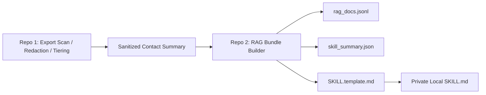

# Architecture

```mermaid
flowchart LR
    A["Repo 1: Export Scan / Redaction / Tiering"] --> B["Sanitized Contact Summary"]
    B --> C["Repo 2: RAG Bundle Builder"]
    C --> D["rag_docs.jsonl"]
    C --> E["skill_summary.json"]
    C --> F["SKILL.template.md"]
    F --> G["Private Local SKILL.md"]
```

## Design Choice

两仓库拆分的核心原因是隐私边界：

- 仓库 1 面向“结构化安全输入”
- 仓库 2 面向“技能编排和自动化骨架”

这样开源部分可以复用，但私人部分必须继续保留在本地。

